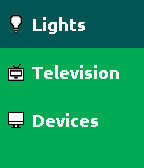
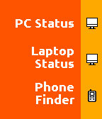
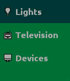

# Stateful

`Stateful` is a Pebble watchapp designed to control RESTful API's with minimal clicks. 

# Interface

The watch interface is split up into distinct 'tiles'. A tile in `stateful` is a grouping of up to 6 button clicks, each of which can call a RESTful endpoint with arbitrary data.

Each tile has an overflow menu that can be accessed by long pressing the middle button.

Multiple tiles can coexist. There is a menu system which allows navigation between tiles:

# Wiki

Head over to the [Wiki](../../wiki) for more information on usage.